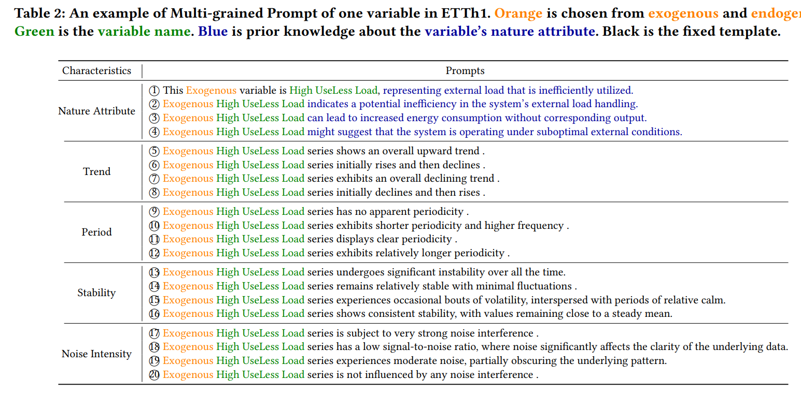

# Official Code for "Exploiting Language Power for Time Series Forecasting with Exogenous Variables"


------

### 1. Datasets

All datasets can be found in the Time-Series-Library, which can be downloaded into the `dataset` folder.

------

### 2. Generating MGP and MTI

We have provided the complete code for generating the text. To generate the corresponding prompts, navigate to the `./dataset` folder and run `ExoLLM_${datasetname}_MTI_MGP_Generate.py`. The generated files will be saved to `./dataset/${data_name}.pt`.



------

### 3. Running the Code

We have uploaded the running script. You can execute the results by running the following command:

```
sh ./script/weather.sh
```

------

### 4. Results

The log file `weather_96_96.log` will contain the following results:

```
mse: 0.0011971251806244254
mae: 0.02340604753792286
```

------
